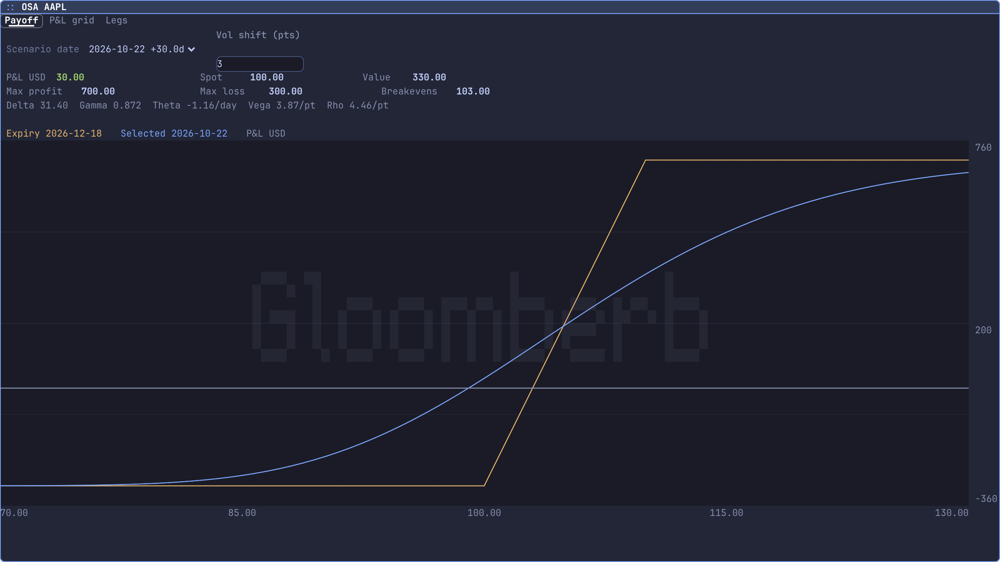
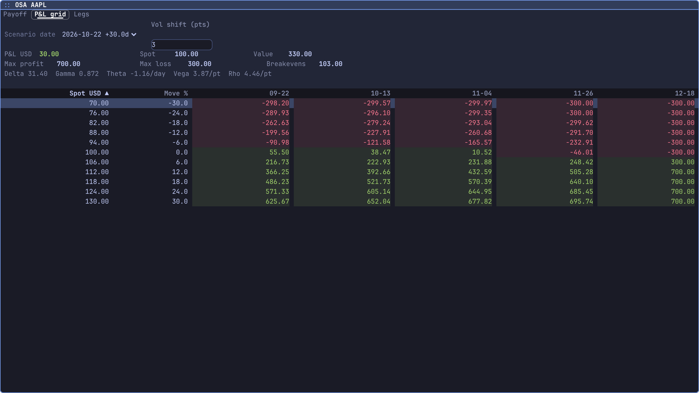
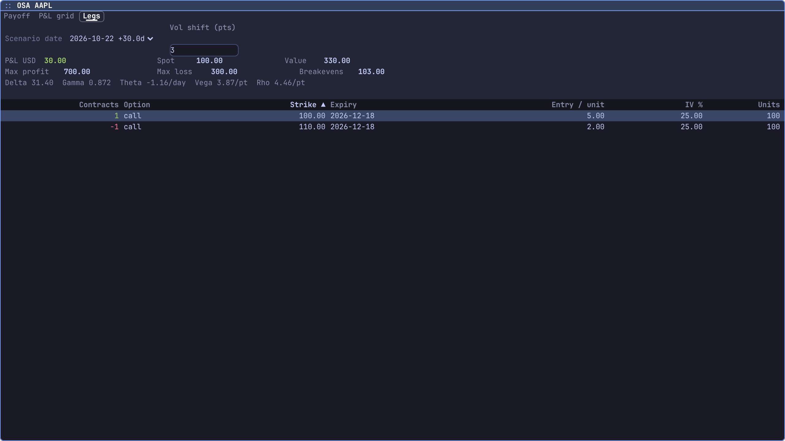
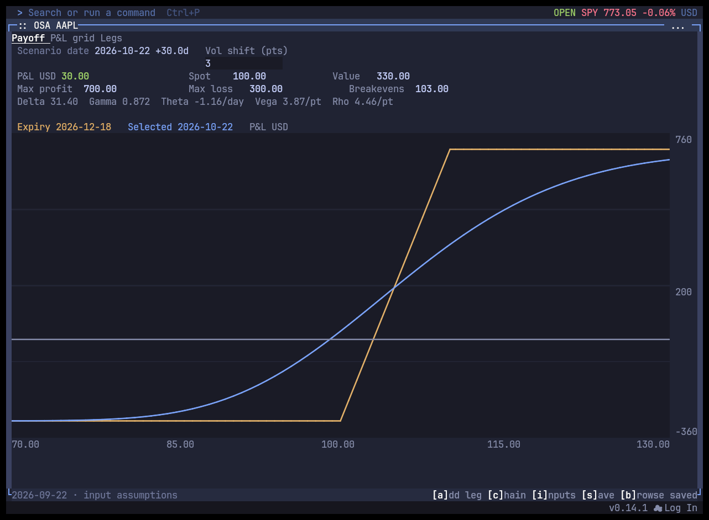
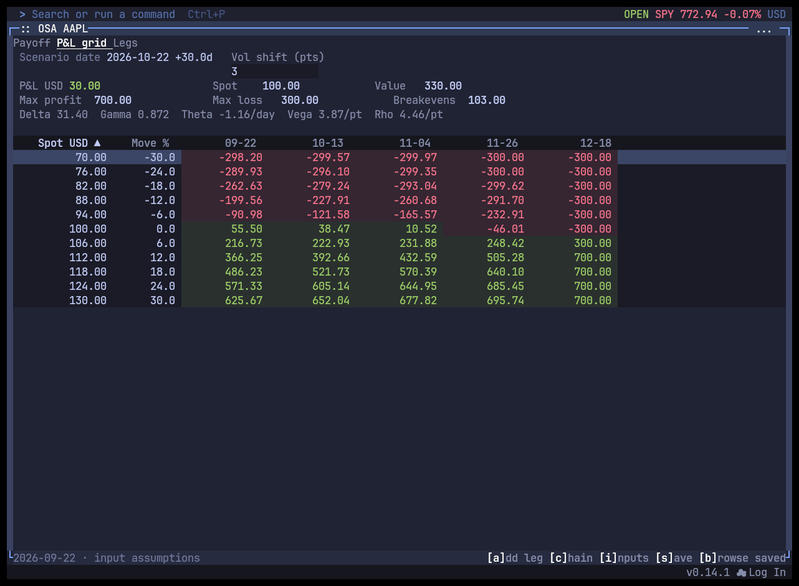

# OSA scenario evidence

September 22, 2026. Explicit hypothetical AAPL call vertical: long one December 18 call at100 for5, short one call at110 for2;100 units/contract,25% IV, spot100 USD,4% rate and1% dividend yield. Valuation September22, selected October22, parallel vol shift+3 points. This is supplied-input evidence, not a live trade recommendation or current AAPL chain.

Expiry breakeven103, maximum profit700 USD and maximum loss300 USD. Selected-date P&L30.00 USD, value330.00, delta31.40, gamma0.872, theta-1.16/day, vega3.87/point and rho4.46/point.

Desktop captures use `gloomberb shot OSA` and validated numerical model evidence. Terminal captures use Kitty's bitmap renderer with the same live pane and supplied inputs. All capture processes were stopped.

