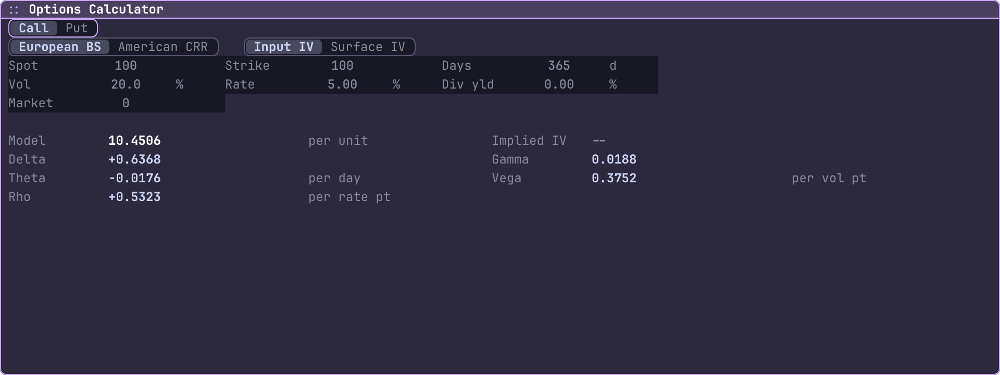
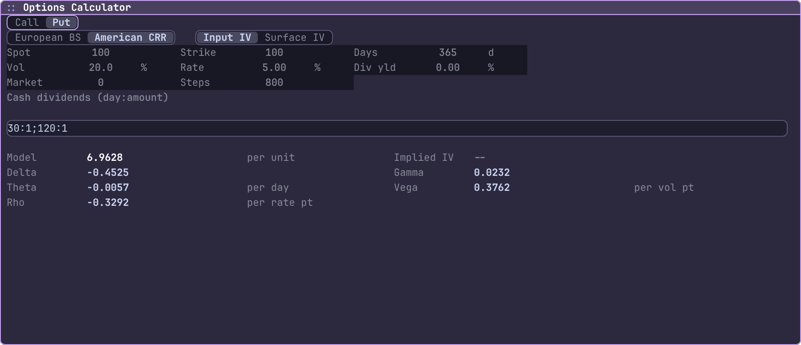
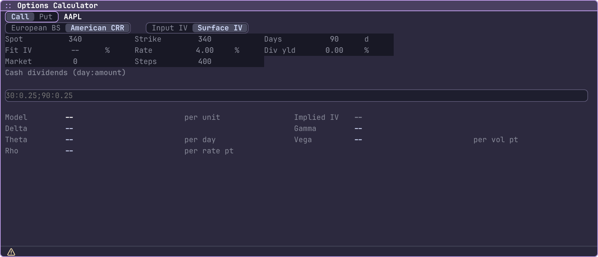
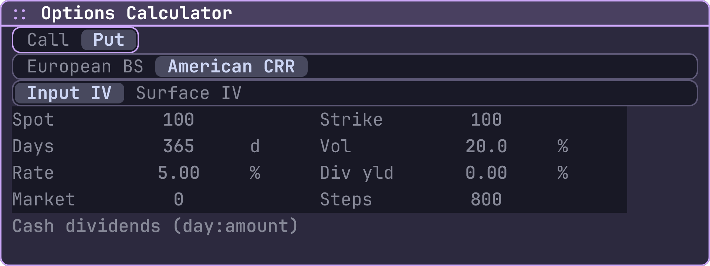
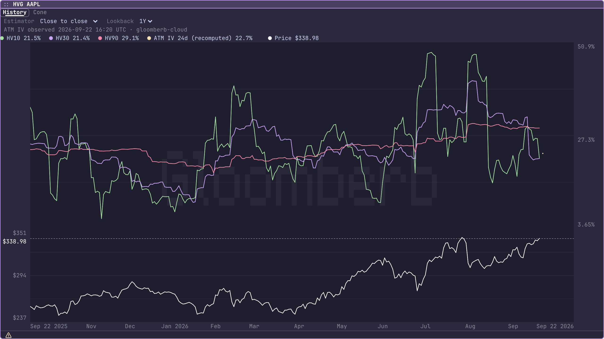
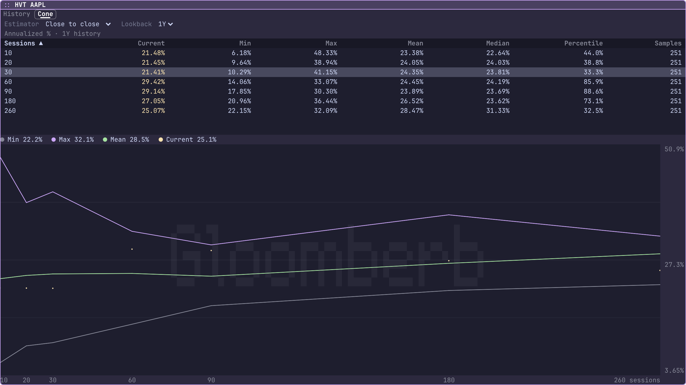

# Volatility screenshot evidence, September 22, 2026

Captured from `feat/vol-7a-shots` using the desktop screenshot command. OVME inputs are frozen before rendering and the six price/Greek values are verified against the selected model. All seven result rows, including the optional implied-IV row, must be fully visible. Every PNG was inspected.

| Capture | Result | Numeric observations | Value per unit |
| --- | --- | ---: | ---: |
| [European call](ovme-european.png) | usable, complete, no mismatch | 6 | 10.4505754154 |
| [American put with cash dividends](ovme-american.png) | usable, complete, no mismatch | 6 | 6.9628155813 |
| [AAPL surface unavailable](ovme-surface-unavailable.png) | correctly unusable and incomplete | 0 | unavailable |
| [Clipped American calculator](ovme-clipped.png) | correctly unusable because result rows are offscreen | 6 calculated, 0 visible | hidden |
| [AAPL realized history and current IV](hvg-aapl.png) | usable, complete, no mismatch | 1005 | n/a |
| [AAPL volatility cone](hvt-aapl.png) | usable, complete, no mismatch | 28 | n/a |

## European closed form

The textbook one-year at-the-money call uses spot 100, strike 100, volatility 20%, rate 5%, and no dividend yield. Price is 10.4505754154; delta is 0.6368305860.

```bash
gloomberb shot OVME --model european --side call --spot 100 --strike 100 \
  --days 365 --volatility 20 --rate 5 --dividend-yield 0 \
  --width 960 --height 360 --output ovme-european.png --json
```



## American exercise with discrete dividends

The put uses the same spot, strike, tenor, volatility and rate, with cash dividends of 1 per underlying unit after 30 and 120 days. The 800-step CRR value is 6.9628155813; delta is -0.4524658784. These are explicit hypothetical inputs.

```bash
gloomberb shot OVME --model american --side put --spot 100 --strike 100 \
  --days 365 --volatility 20 --rate 5 --dividend-yield 0 \
  --dividends '30:1;120:1' --steps 800 \
  --width 960 --height 420 --output ovme-american.png --json
```



## Unavailable surface

The 90-day AAPL call uses hypothetical spot and strike 340, rate 4%, and dividend yield 0. The December 18, 2026 surface bracket was stale during the final capture, so the displayed fit, price and Greeks remain unavailable. The screenshot reports unusable, incomplete, no numeric observations, and AAPL unavailable. A 20-day request was also rejected when its October 9 bracket became stale.

```bash
gloomberb shot OVME --model american --symbol AAPL --spot 340 --strike 340 \
  --days 90 --rate 4 --dividend-yield 0 --vol-source surface \
  --width 960 --height 420 --output ovme-surface-unavailable.png --json
```



## Clipped result rejection

Increasing scale to 2 leaves only enough space for the form. The model still calculates six metrics, but none of the result rows are visible. The screenshot correctly reports unusable and names all seven missing result rows in its mismatch details.

```bash
gloomberb shot OVME --model american --side put --spot 100 --strike 100 \
  --days 365 --volatility 20 --rate 5 --dividend-yield 0 \
  --dividends '30:1;120:1' --steps 800 \
  --width 960 --height 360 --scale 2 --output ovme-clipped.png --json
```



## Realized volatility regression checks

HVG and HVT already expose verified screenshot evidence. Both use daily history through September 21. HVG contains a single current ATM IV observation of 22.7033238551%, observed September 22 at 16:20:04 UTC from Gloom Cloud, for the October 16 expiry. HVT was captured with the optional IV source switched off.

```bash
gloomberb shot HVG AAPL --output hvg-aapl.png --json
gloomberb shot HVT AAPL --show-iv false --output hvt-aapl.png --json
```




