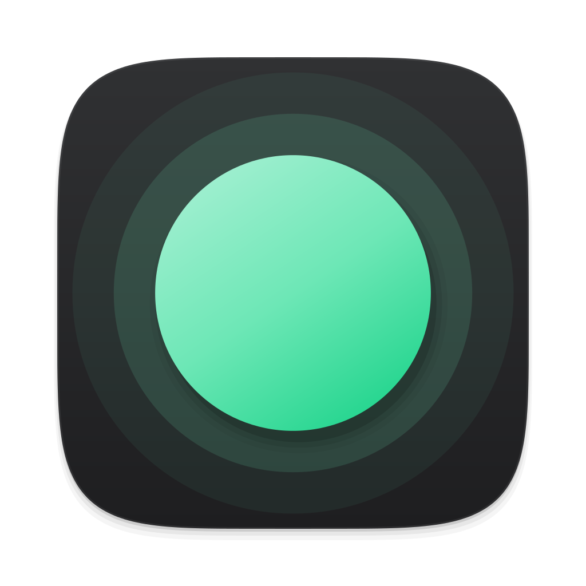
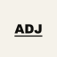

<div align="center">



# Gloomberb

**Open-source finance terminal. Fast, keyboard-driven, and extensible.**

Desktop app for macOS and Windows. Terminal UI for macOS, Linux, and Windows.

<a href="https://gloom.sh/download/desktop"><strong>Download desktop</strong></a>
&nbsp;&middot;&nbsp;
<a href="#install"><strong>Install the TUI</strong></a>
&nbsp;&middot;&nbsp;
<a href="https://term.gloom.sh"><strong>Open in browser</strong></a>
&nbsp;&middot;&nbsp;
<a href="README.zh-CN.md">简体中文</a>

<br />
<br />


<sub>Backed by <a href="https://adjacent.markets/?ref=gloomberb"> Adjacent</a></sub>

</div>

- **Research companies:** quotes, charts, financials, filings, options, and analyst ratings.
- **Follow markets:** news, global indices, FX, economic events, and market scanners.
- **Manage your workspace:** portfolios, watchlists, broker connections, alerts, notes, and AI tools.

The desktop app and TUI share the command language and plugin system. The [browser app](https://term.gloom.sh) offers a smaller feature set and requires a free Gloom Cloud account: free market data is rate-limited and delayed by 15 minutes; Pro provides realtime data. See [browser features and limits](docs/browser.md).

## Install

### Desktop

On **macOS (Apple Silicon)**:

```bash
brew install --cask gloomberb
```

On **Windows 11**, [download the installer](https://github.com/gloom-sh/gloomberb/releases/latest/download/stable-win-x64-GloomberbSetup.exe). It supports x64, and ARM64 through x64 emulation.

Both desktop installers include the `gloomberb` terminal command.

### Terminal

On **macOS or Linux**:

```bash
curl -fsSL gloom.sh/install | bash
```

On Apple Silicon Macs, this installs the desktop app and TUI. On Intel Macs and Linux, it installs the standalone TUI.

Or install with [Bun](https://bun.sh) on macOS, Linux, or Windows x64:

```bash
bun install -g gloomberb
```

Run `gloomberb` to launch. For graphics, use a Kitty-compatible terminal such as Ghostty, Kitty, or WezTerm. See the [installation guide](docs/installation.md) for direct downloads, install locations, and updates.

## Start

Press `Ctrl+P` to open the command bar, or press `` ` `` to search for a ticker. Desktop also supports `Cmd/Ctrl+K`.

| Try | Opens |
|-----|-------|
| `DES AAPL` | Company details |
| `GP NVDA` | Price chart |
| `OVDV AAPL` | Implied-volatility surface and options term structure |
| `OPX SPY` / `GEX SPY` | Open interest by strike and expiry, max pain and dealer gamma ([method](docs/options-positioning.md)) |
| `HVG AAPL` / `HVT AAPL` | Realized volatility and volatility cones |
| `SEAS AAPL` | Seasonality: monthly returns by year and year overlays |
| `RDCF AAPL` | Reverse DCF: the cash flow growth the price assumes |
| `COT [code or root]` | CFTC positioning and cross-market extremes |
| `DOE` / `NGS` | EIA weekly oil stocks and gas storage, with builds, draws and five-year ranges |
| `CPI [component]` / `ECAN` | US consumer prices by component, with weights, contributions to the headline and the next release |
| `TOP` | Market stories |
| `WIRP` / `FFIP` | US rate path and conditional FOMC probabilities |
| `BTMM` | Funding rates, bill curves and Federal Reserve liquidity |
| `CTM [root]` | Futures contract curve, historical ghosts, roll yield and open interest, including `CTM VX` |
| `PF` | Portfolios and watchlists |
| `HELP` | Commands and keyboard shortcuts |

Use `Tab` to switch panes and `j` / `k` to navigate lists. The [user guide](docs/usage.md) covers charts, broker setup, keyboard shortcuts, and the full command reference. See [research data conventions](docs/research-data.md) for return definitions, financial sources, and model assumptions. [Supply chain disclosures](docs/supply-chain.md) explains SPLC evidence, reverse relationships and flow diagrams.

## CLI

Run commands directly from your shell:

```bash
gloomberb quote AAPL
gloomberb quote AAPL --json
gloomberb help
```

Output is human-readable by default; use `--json`, `--csv`, or `--ndjson` for scripts. See the [CLI reference](docs/usage.md#cli) for commands and flags.

## Plugins and contributing

Plugins add panes, data providers, broker connections, and commands. Install one from GitHub:

```bash
gloomberb install gloom-sh/gloom-tv
```

See the [plugin development guide](PLUGINS.md), [TV setup](docs/usage.md#live-tv), or [contributing guide](CONTRIBUTING.md) to get started.

Available in English, Spanish, Simplified Chinese, Traditional Chinese, Japanese, and Korean. Use `LANG` in the command bar to switch; see [language settings](docs/usage.md#localized-interface).

[MIT licensed](LICENSE). Built with [OpenTUI](https://opentui.com/).

## Crash reports and usage counts

When the app hits an uncaught error, a render crash, or a plugin that fails to load, it sends a crash report to Gloom's API (`api.gloom.sh`), which forwards it to error tracking. A report contains the error type, message and stack trace, the app version, the operating system, and which surface it came from (terminal, desktop or web); when a plugin failed, its id. Your home directory is replaced with `~` before sending. Reports are tied to your account only when you are signed in.

The app also counts how often you open each function, from the command bar, a menu or a link in another pane, and which functions are on screen when a workspace is restored at launch. It sends each function's mnemonic (such as `DES` or `GP`) with those two counts, the surface, the app version and the operating system, a minute after the first count, then every 15 minutes, and when you quit. Functions from plugins other than the official gloom-sh ones are sent as `plugin`, so their names never leave your machine. The server adds your plan (signed out, Free or Pro); the counts are never tied to your account.

Neither contains anything from your workspace: no tickers, arguments, portfolios, watchlists, layouts, settings or queries. Both carry a random install id stored in `install-id` in the data folder, `~/.gloomberb` by default (in the browser, in local storage).

The usage setting also covers command bar searches. When you are signed in, a search you finish in the command bar (you pause typing or run something, never each keystroke) is stored with your account to improve search: its text, the AI suggestions it got and the result you picked. Searches are deleted with your account.

To turn either off, run `Crash Reports` or `Usage Counts` from the command bar, or:

```bash
gloomberb config set telemetry.crashReports false
gloomberb config set telemetry.usage false
```

Setting `GLOOMBERB_NO_TELEMETRY=1` or `DO_NOT_TRACK=1` in the environment turns all of it off. The browser app also honours Do Not Track and Global Privacy Control.

## Sponsors

<a href="https://adjacent.markets/?ref=gloomberb"></a>

[Adjacent](https://adjacent.markets/?ref=gloomberb) builds prediction-market indices, reference rates, and data. Thank you for backing Gloomberb's open-source work.

To sponsor Gloomberb, email [hello@gloom.sh](mailto:hello@gloom.sh).
