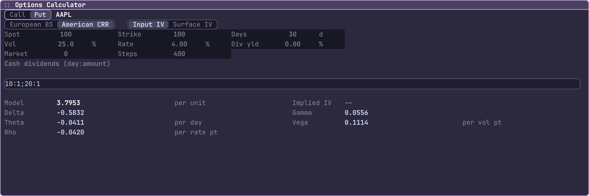
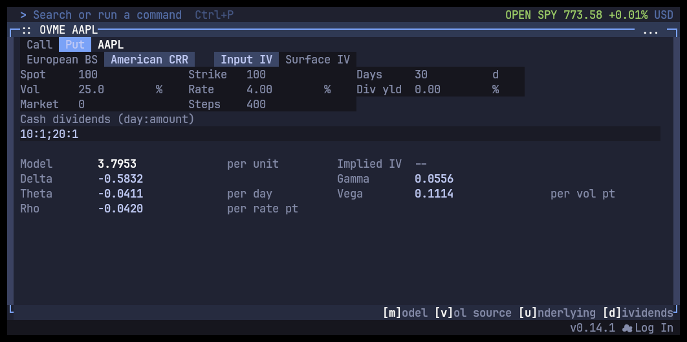

# OVME verification, 2026-09-22

The desktop and native terminal captures use an American put, spot 100, strike 100, 30 calendar days, 25% volatility, 4% rate, zero continuous dividend yield and 400 requested CRR steps. Two cash dividends pay 1 per underlying unit on days 10 and 20. AAPL is an illustrative symbol; these are explicit assumptions, not a live quote or observed dividend schedule.

Both renderers show value 3.7953, delta -0.5832, gamma 0.0556, theta -0.0411 per day, vega 0.1114 per volatility point and rho -0.0420 per rate point. The attached CLI report contains the unrounded values. The European reference report returns 10.4506 for a one-year at-the-money call with 20% volatility and a 5% rate.





## Reproduce

```sh
bun src/index.tsx fn OVME --model american --side put --symbol AAPL \
  --spot 100 --strike 100 --days 30 --volatility 25 --rate 4 \
  --dividend-yield 0 --dividends '10:1;20:1' --steps 400 --json

bun src/index.tsx shot OVME --model american --side put --symbol AAPL \
  --spot 100 --strike 100 --days 30 --volatility 25 --rate 4 \
  --dividend-yield 0 --dividends '10:1;20:1' --steps 400 \
  --width 1080 --height 340 --output /tmp/ovme-american.png
```

The native capture runs the actual terminal pane in Kitty at 104 columns by 22 rows, with persisted pane settings matching the command. All capture-owned app, Kitty, Xvfb and browser processes were stopped after capture.

The PNGs were visually inspected. OVME uses the generic screenshot path, which currently reports zero semantic numerical rows and `usable=false`; this gallery records visual evidence and the separately verified numeric report. OSA's numerical screenshot readiness is handled by its dedicated evidence path.
