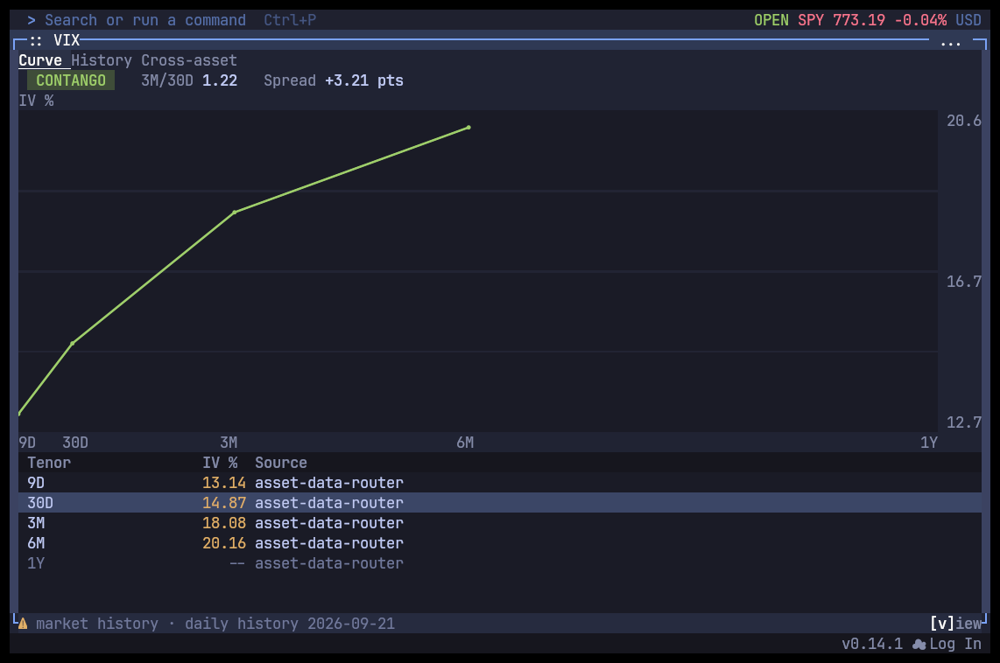
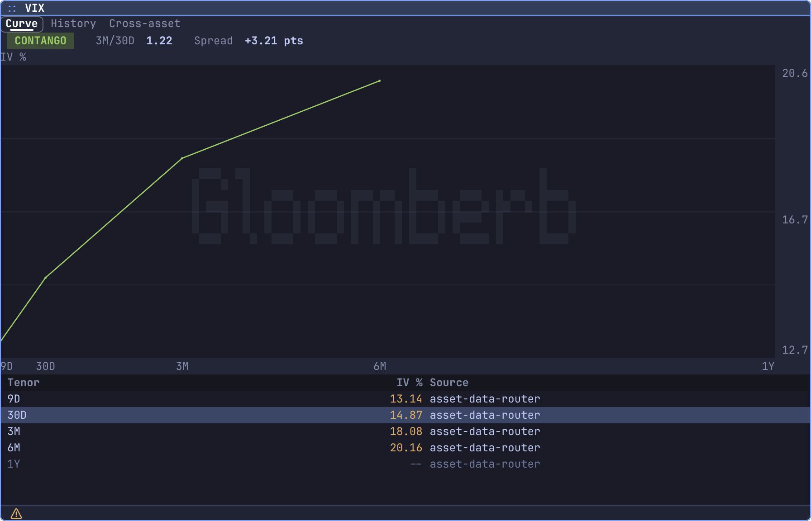
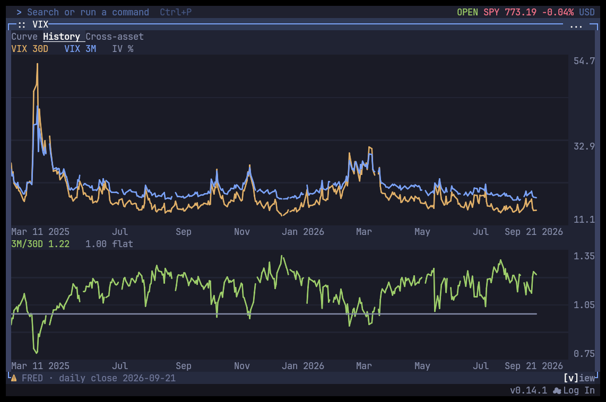
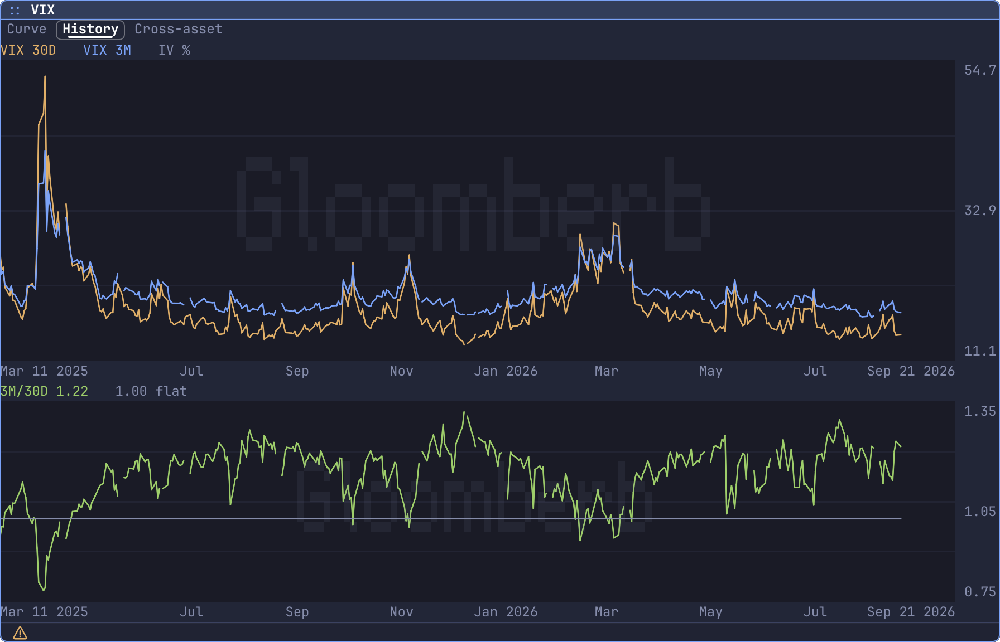
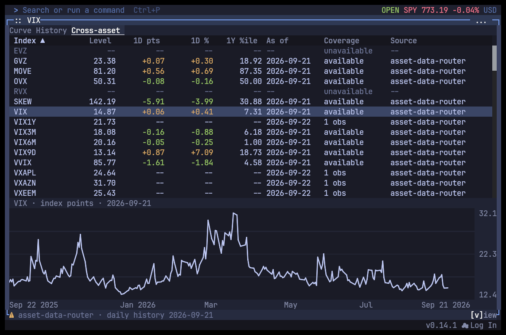
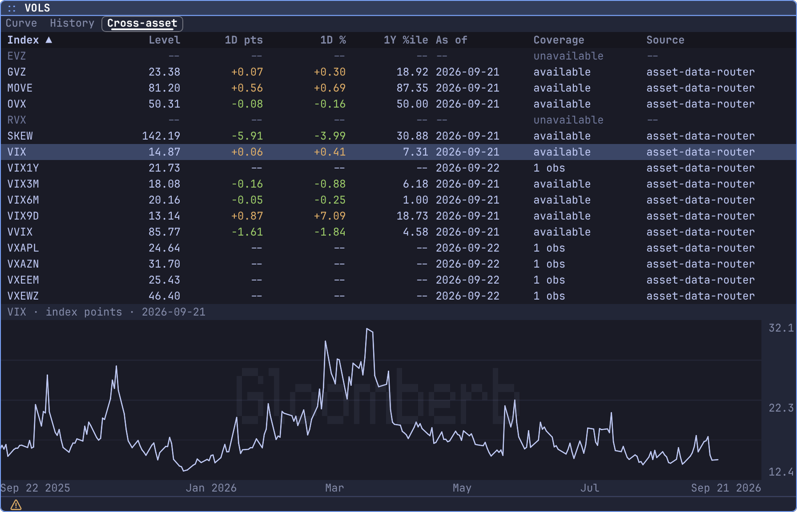

# VIX and cross-asset volatility screenshots

Captured on 2026-09-22 from feature commit `0f070d81`. Real upstream observations through the normal asset-data router, including enabled Yahoo fallback. All captures used isolated application homes and the Tokyo theme. No fixture data is shown.

Terminal captures are the actual OpenTUI app in Kitty with native bitmap charts, at 112 columns by 32 rows. Desktop captures use the Electrobun view renderer through the CLI screenshot command at 896 by 576 CSS pixels, with 2x output scaling.

## Source state and screenshot readiness

| View | Source state | Semantic screenshot result |
| --- | --- | --- |
| Curve | Four matched tenors dated 2026-09-21. The 1Y source has only a 2026-09-22 observation and remains a gap. | 4 plotted values; complete false; usable false; semantic mismatch false. |
| History | FRED VIXCLS and VXVCLS through 2026-09-21: 396 VIX points, 385 3M points, 385 matched ratio dates. | 1,166 plotted values; complete true; usable true; semantic mismatch false. |
| Cross-asset board | 18 of 20 levels available. RVX and EVZ unavailable through the current router. Eight available rows contain only one intraday observation. | 271 observed values including the selected VIX history; complete false; usable false; semantic mismatch false. |

The partial curve and board are intentionally displayed with missing values. Their `usable: false` metadata reflects incomplete upstream coverage, not a failed render. The board is scrollable; the capture shows its upper rows.

The eight one-observation rows are VIX1Y, VXEEM, VXEWZ, VXAPL, VXAZN, VXGOG, VXGS and VXIBM. They have no fabricated 1D change or percentile. Current-session observations are not labeled daily closes.

The curve uses official tenor distances of 9, 30, 93, 184 and 366 days. Matched values are 13.14, 14.87, 18.08 and 20.16. The 3M/30D ratio is 1.2158708852 and the spread is 3.2100000381 index points.

Direct FRED publication checks found the optional CBOE series current through 2026-09-21 except EVZCLS, whose final published observation was 2025-03-11. The existing cloud FRED route supports VIXCLS and VXVCLS only. Additional FRED series are therefore routing gaps, not assumed discontinued publications. VX, VX=F and VIX futures-style probes did not resolve; no VIX futures curve is implied here.

## VIX tenor curve

### Terminal

### Desktop

## VIX and VIX3M history

### Terminal

### Desktop

## Cross-asset volatility board

### Terminal

### Desktop

